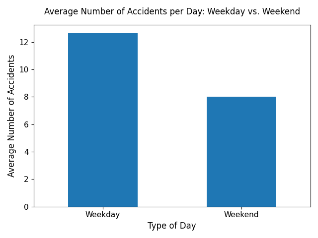

# Štatistická analýza dopravných nehôd v Brne

**Autor:** Lukáš Hellesch 21. 08. 2025

---

## Úvod

Táto práca sa zaoberá analýzou dát Dopravné nehody v Brne. Cieľom práce je preskúmať a overiť niekoľko hypotéz.
Aby python program fungoval tak treba stiahnuť dáta vo formáte csv do priečinku data. Dáta boli moc veľké, a preto som ich neukladal na GitHub.

### Použité dáta
* **Zdroj:** Data Brno - [Dopravné nehody v Brne](https://data.brno.cz/datasets/298c37feb1064873abdccdc2a10b605f_0)

Dáta boli načítané a spracované v Pythone s použitím následujúcich libiek `pandas`, `matplotlib` a `scipy`.

---

### Hypotéza 

Základná hypotéza sa týka rozdielu v počte nehôd medzi pracovnými dňami a víkendom.

* **H₀ (Nulová hypotéza):** Frekvencia dopravných nehôd je v pracovné dni a cez víkend rovnaká. Akýkoľvek pozorovaný rozdiel je iba dielom náhody.
* **H₁ (Alternatívna hypotéza):** Existuje štatisticky významný rozdiel v počte dopravných nehôd medzi pracovnými dňami a víkendom.

### Vedľajšie výskumné otázky

Okrem hlavnej hypotézy, keď som mal už dáta spracované som sa pozrel aj na tieto otázky
1.  Ako sa líši nehodovosť v jednotlivých dňoch týždňa?
2.  Má ročné obdobie vplyv na celkový počet nehôd?
3.  Ako sa vyvíja počet nehôd v priebehu dňa a líši sa tento trend medzi pracovnými dňami a víkendom?

---
## Hlavná analýza

V tejto časti sú prezentované grafy, ktoré vizualizujú dáta a ich cieľ je zodpovedať moje otázky a potvrdiť prípadne vyvrátiť moje hypotézy

### Porovnanie počtu nehôd: Pracovné dni vs. víkend

Tento graf priamo vizualizuje dáta relevantné k našej hlavnej hypotéze.

Na prvý pohľad zrejmé, že počet nehôd v kategórii pracovný deň je výrazne vyšší ako v kategórii víkend

Tento výsledok som aj čakal, dá sa to vysvetliť tým, napr. že počas týždňa veľa ľudí chodí do práce alebo do školy a počas víkendu veľa ľudí sedí doma a nikam nejde.
Graf poskytuje silný predbežný dôkaz na podporu našej alternatívnej hypotézy H₁, že medzi týmito dvoma kategóriami existuje štatisticky významný rozdiel.

### Počet nehôd v jednotlivých dňoch týždňa

Tento graf detailne rozdeľuje celkový počet nehôd na jednotlivé dni v týždni.
Graf len ďalej potvrdzuje, že počas týždňa nastáva viacej dopravných nehôd, ako počas víkendu.

Cez týždeň prichádza k viacerým nehodám kvôli hustej premávke a dopravným špičkám.
Z týchto dní je najhorší piatok, kedy sa k tomu pridávajú ľudia cestujúci na víkend.
Víkendy, najmä nedeľa, sú naopak najpokojnejšie, pretože je na cestách menej áut.

Tieto zistenia ďalej potvrdzujú našu hypotézu, že rozdelenie nehôd nie je v rámci týždňa rovnomerné.

### Nehodovosť v priebehu dňa
Tento čiarový graf znázorňuje vývoj počtu nehôd v priebehu 24 hodín
- jeden pre pracovné dni
- druhý pre víkendy 

Tieto dva odlišné priebehy dokonale odrážajú pracovnú dobu a pohyb ľudí. Dva vrcholy počas pracovného dňa presne zodpovedajú dopravným špičkám.

Plochší a neskorší vrchol cez víkend odráža, to že viacej ľudí dlhšie spí a nemajú dôvod nikam ísť a ak idú tak odchádzajú neskôr.

### Vplyv ročných období na nehodovosť

Graf porovnáva celkový počet nehôd v jednotlivých ročných obdobiach.

Čakal som že medzi ročnými obdobiami budú minimálne rozdiely a ak nejaké budú tak v zime a jeseňi bude dopravných nehôd určite viac.
Paradoxne tento graf ukazuje presný opak. Možným vysvetlením je, že počas Vianoc a zimných prázdnin je v Brne menej ľudí a teda aj menej áut.
Menej áut na cestách tak zrejme zníži počet nehôd viac, ako ho zvýši zlé počasie.

## Štatistické testovanie hypotéz

Vizuálne sme potvrdili, že v pracovné dni sa stáva viac nehôd, ako cez víkend. 
Formálne to overíme pomocou dvoj výberového t-testu

Po aplikovaní t-testu na naše dve skupiny dát (pracovné dni / víkend) sme získali nasledujúce výsledky:
* Priemerný počet nehôd (pracovné dni): 12.6 nehôd za deň
* Priemerný počet nehôd (víkend): 8.0 nehôd za deň
* t-štatistika: 26.18
*  výsledná P-hodnota (p-value): 2.62e-137

Kľúčovým výstupom je p-hodnota, ktorá je prakticky nulová.

Keďže táto p-hodnota je extrémne nízka a oveľa menšia ako stanovená hladina významnosti a = 0.05, **nulovú hypotézu zamietame**.

## Záver

Analýza dát priniesla niekoľko kľúčových zistení:

* **Potvrdenie hlavnej hypotézy:** Počet dopravných nehôd je v pracovné dni štatisticky významne vyšší, ako počas víkendu. Nulová hypotéza o rovnakom počte nehôd bola na základe t-testu zamietnutá.
* **Denné a týždenné trendy:** Najvyššia nehodovosť v rámci týždňa pripadá na piatok. V priebehu dňa sme videli dve výrazné dopravné špičky v pracovné dni (ranná a popoludňajšia (po práci)), zatiaľ čo víkendový priebeh je plynulejší bez významných nárastov v dopravných nehodách.
* **Sezónny vplyv:** Najmenej nehôd sa paradoxne stáva v zime. Ako som spomínal pravdepodobne to je tým, že v meste počas zimných prázdnin a sviatkov je oveľa menej áut, čo prevažuje nad zlým počasím.

Dopravná nehodovosť v Brne je významne ovplyvnená faktormi, ktoré súvisia so správaním ľudí počas pracovných dní a daných sezón.

